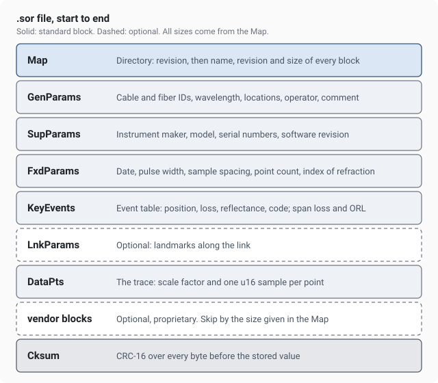

# The .sor file format and other OTDR references

Free reference material for anyone who works with OTDR traces: the layout of the Bellcore/Telcordia `.sor` file, a list of OTDR software and libraries, a glossary of trace terms in fifteen languages, and a table of the file extensions instruments write.

Maintained by the team behind [OTDR Master](https://otdrmaster.com/?utm_source=github&utm_medium=referral&utm_campaign=sor-format), an online viewer that opens `.sor`, `.msor`, `.trc` and other OTDR files in the browser.

## What is here

- [The .sor file format, block by block](docs/sor-format.md). What each block of a Telcordia SR-4731 file holds, field by field, for versions 1 and 2. Read it if you are writing a parser, or if two programs show different numbers for the same file.
- [Awesome OTDR](awesome-otdr.md). Online viewers, desktop software, open-source parsers and learning material.
- [OTDR glossary in 15 languages](glossary/README.md). Twenty-seven trace terms in the words technicians use, also as [CSV](glossary/otdr-glossary.csv).
- [File extensions of OTDR instruments](formats.md). Which instruments write `.sor`, `.msor`, `.trc`, `.tst` and the rest.

## Open a trace without installing anything

To look at a `.sor` file right now, drop it on [otdrmaster.com/app](https://otdrmaster.com/app?utm_source=github&utm_medium=referral&utm_campaign=sor-format). The event table, A and B cursors, loss measurements and a PDF report work without an account. There is a demo trace on the start screen if you have no file at hand.

## Contributing

Found a mistake in the format map, a term that reads wrong in your language, or a tool missing from the list? Open an issue or a pull request.

## License

Text and data in this repository are licensed under [CC BY 4.0](LICENSE). You may reuse them anywhere, including commercially, as long as you credit the source with a link to this repository.
